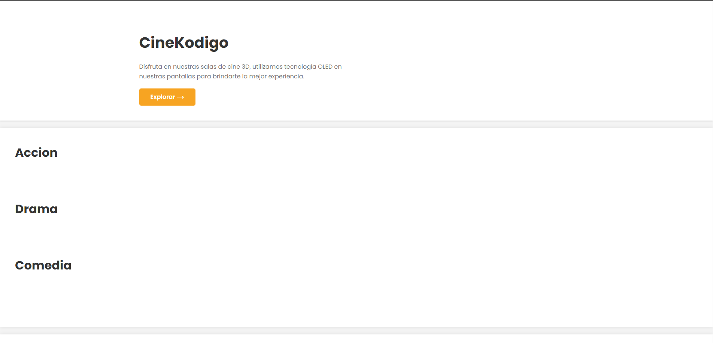

# CineCode - Cinema Management System

CineCode is a cinema management application designed to simplify and automate cinema administration. With CineCode, you can have complete control over movies currently in theaters, manage a list of completed movies, and perform CRUD (Create, Read, Update, Delete) operations on the movie database.

## Key Features

- **General Dashboard**: A central control panel that displays key information about movies currently in theaters, providing an overview of the current status.

- **List of Movies in Theaters**: Easily view movies that are currently in theaters, along with details such as start date, duration, genre, and more.

- **Movie CRUD Operations**: Efficiently manage the movie database with Create, Read, Update, and Delete movie operations.

## Screenshots

*Screenshot of the CineCode General Dashboard*

*Screenshot of the List of Movies in Theaters*

## Installation

1. Clone this repository to your local machine.
2. Create a database named `Kodigo_FullStack` on a MySQL instance.
3. Run `mvn clean install` to compile the project.
4. Start the application with `mvn spring-boot:run`.

## Usage

1. Access the control panel through your web browser.
2. Explore movies currently in theaters and the complete list of movies.
3. Use CRUD functions to manage the movie database as needed.

## Contribution

We welcome contributions! If you'd like to contribute to CineCode, follow these steps:

1. Create a fork of the repository.
2. Clone your fork to your local machine.
3. Create a branch for your changes: `git checkout -b feature/new-feature`.
4. Make your changes and commit: `git commit -m 'Add new feature'`.
5. Push your changes to your fork: `git push origin feature/new-feature`.
6. Create a pull request in the original repository.

## License

This project is licensed under the MIT License. See the [LICENSE](LICENSE) file for more details.

## Contact

If you have any questions or comments about CineCode, feel free to contact us at [marioaquinojob@gmail.com](mailto:marioaquinojob@gmail.com).

Thank you for using CineCode!
