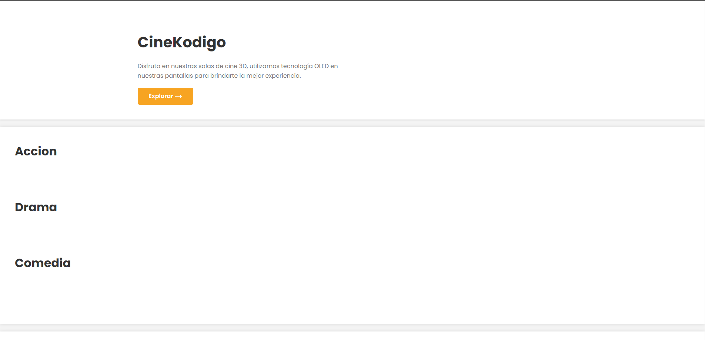
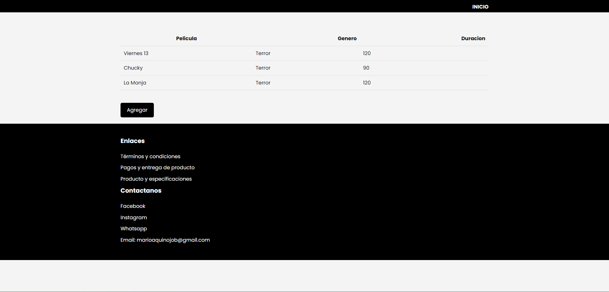

# CineCode - Sistema de Gestión de Cine

CineCode es una aplicación de gestión de cine diseñada para simplificar y automatizar la administración de un cine. Con CineCode, puedes llevar un control completo de las películas en cartelera, gestionar una lista de películas completas y realizar operaciones CRUD (Crear, Leer, Actualizar, Eliminar) en la base de datos de películas.

## Características Principales

- **Dashboard General**: Un panel de control central que muestra información clave sobre las películas en cartelera, proporcionando una vista general del estado actual.

- **Lista de Películas en Cartelera**: Visualiza fácilmente las películas que están actualmente en cartelera, junto con detalles como la fecha de inicio, duración, género, y más.

- **Operaciones CRUD de Películas**: Administra la base de datos de películas de manera eficiente con las operaciones de Crear, Leer, Actualizar y Eliminar películas.

## Capturas de Pantalla

*Captura de pantalla del Dashboard General de CineCode*

*Captura de pantalla de la Lista de Películas en Cartelera*

## Instalación

1. Clona este repositorio en tu máquina local.
2. Crea una base de datos llamada `Kodigo_FullStack` en una instancia de mysql.
3. Ejecuta `mvn clean install` compilar el proyecto.
4. Inicia la aplicación con `mvn spring-boot:run`.

## Uso

1. Accede al panel de control a través de tu navegador web.
2. Explora las películas en cartelera y la lista completa de películas.
3. Utiliza las funciones de CRUD para gestionar la base de datos de películas según sea necesario.

## Contribución

¡Agradecemos contribuciones! Si deseas contribuir a CineCode, sigue estos pasos:

1. Crea un fork del repositorio.
2. Clona tu fork en tu máquina local.
3. Crea una rama para tus cambios: `git checkout -b feature/nueva-funcionalidad`.
4. Realiza tus cambios y commitea: `git commit -m 'Añadir nueva funcionalidad'`.
5. Empuja tus cambios a tu fork: `git push origin feature/nueva-funcionalidad`.
6. Crea una solicitud de extracción (Pull Request) en el repositorio original.

## Licencia

Este proyecto está bajo la Licencia MIT. Consulta el archivo [LICENSE](LICENSE) para obtener más detalles.

## Contacto

Si tienes alguna pregunta o comentario sobre CineCode, no dudes en ponerte en contacto con nosotros en [marioaquinojob@gmail.com](mailto:marioaquinojob@gmail.com).

¡Gracias por usar CineCode!
